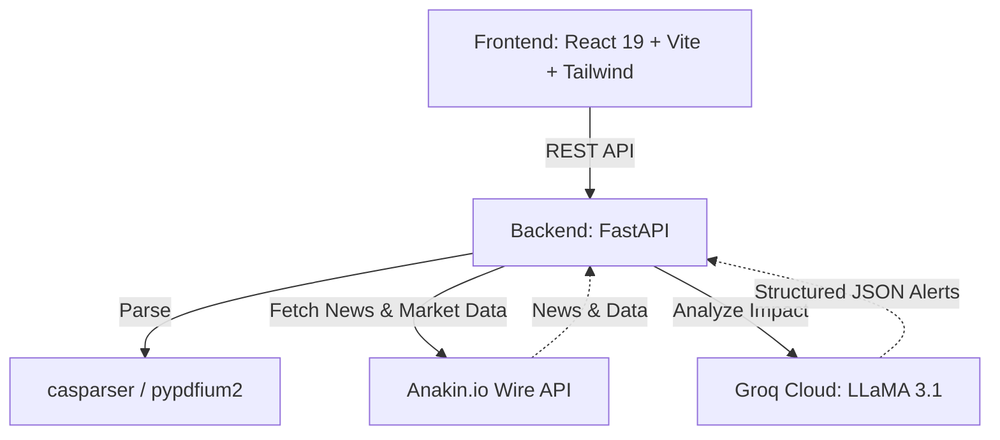

# 📊 FolioSync — Investment Command Center

[](https://foliosync-production.up.railway.app)
[](LICENSE)
[](https://python.org)
[](https://react.dev)

A real-time investment intelligence dashboard that parses Indian portfolio statements (CAMS CAS PDFs, Groww/Zerodha CSVs) and delivers AI-powered macro analysis, IPO tracking, and advanced portfolio health insights.

FolioSync bridges the gap between static portfolio trackers and dynamic market intelligence by mapping your specific holdings against live, up-to-the-minute global financial news via Groq's LLaMA 3.1 models and Anakin.io Wire APIs.

---

## ✨ Features

| Feature | Description |
|---------|-------------|
| **PDF/CSV Ingestion** | Securely parse password-protected CAMS CAS PDFs and standard broker CSVs locally. |
| **AI Macro Intelligence** | Groq LLaMA 3.1 analyzes live news explicitly against your specific portfolio holdings to generate actionable alerts. |
| **Advanced Market Data** | Live dashboards for Market Breadth (Advances/Declines), 52-Week Breakouts, RBI Forex Reserves, and Corporate Announcements. |
| **Real-time IPO Tracker** | Up-to-date IPO subscription data and upcoming listings powered by Anakin Wire APIs. |

---

## 🏗️ Architecture

FolioSync uses a modern, decoupled architecture packaged into a single containerized deployment.



---

## 🚀 Getting Started

You can access the live version of this app here: **[FolioSync Live Demo](https://foliosync-production.up.railway.app)**

If you wish to run it locally or deploy your own instance, follow the steps below.

### Prerequisites

- Python 3.11+
- Node.js 18+
- [Anakin API Key](https://anakin.io) (For live market/IPO data)
- [Groq API Key](https://console.groq.com) (For LLaMA 3.1 portfolio analysis)

### Local Development Setup

1. **Clone the repository:**
   ```bash
   git clone https://github.com/yourusername/FolioSync.git
   cd FolioSync
   ```

2. **Backend Setup:**
   ```bash
   cd backend
   python -m venv venv
   source venv/bin/activate        # On Windows: .\venv\Scripts\Activate.ps1
   pip install -r requirements.txt
   
   # Add your API keys
   cp .env.example .env
   # Edit .env and insert ANAKIN_API_KEY and GROQ_API_KEY
   
   # Start the FastAPI server
   uvicorn app.main:app --port 8000 --reload
   ```

3. **Frontend Setup:**
   ```bash
   cd frontend
   npm install
   npm run dev
   ```
   Open **http://localhost:5173** in your browser.

---

## 🐳 Docker / Production Deployment

FolioSync includes a production-ready `Dockerfile` that builds the React frontend and mounts it statically inside the FastAPI backend. It is optimized for one-click deployment on platforms like [Railway](https://railway.app) or Render.

```bash
# Build the container
docker build -t foliosync .

# Run the container (Make sure to pass your API keys)
docker run -p 8000:8000 \
  -e ANAKIN_API_KEY=your_key \
  -e GROQ_API_KEY=your_key \
  foliosync
```

Go to `http://localhost:8000` to use the application.

---

## 🔌 Anakin.io Wire Integrations

This project heavily relies on Anakin.io Wire APIs to fetch real-time Indian financial data.

| Wire Action ID | Data Fetched |
|----------------|--------------|
| `mc_news` | Live Macro financial news headlines |
| `mc_ipo` | IPO subscription and listing data |
| `scr_company_documents` | Live Corporate Announcements & Filings |
| `act_morningstar_in_fund_category_returns` | Mutual Fund Category Returns |
| `nse_52week_highlow` | NSE 52-Week Breakouts |
| `et_advance_decline` | Market Breadth (Advances vs Declines) |
| `act_data_rbi_org_in_foreign_exchange_reserves` | RBI Forex Reserves Data |

---

## 🤖 AI Analysis Deep Dive

Instead of generic market advice, FolioSync provides **hyper-personalized intelligence**. 

The backend feeds the Groq LLaMA 3.1 model a combination of:
1. Your actual portfolio holdings (parsed from your CAS PDF/CSV)
2. Live macro news fetched via Anakin.io

The model then returns a structured JSON payload predicting the direct impact of current events on *your specific assets*. For example, if you hold IT stocks and the US Federal Reserve announces a rate cut, the AI will highlight those specific stocks as "Bullish" with a personalized explanation.

---

## 🔒 Security & Privacy

- **Local Parsing**: PDFs and CSVs are parsed locally in memory. Your financial documents are **never** saved to disk or uploaded to external servers.
- **Secure API Management**: API keys are securely managed via `.env` files and Docker environment variables.

---

## 📄 License

This project is licensed under the MIT License - see the [LICENSE](LICENSE) file for details.
